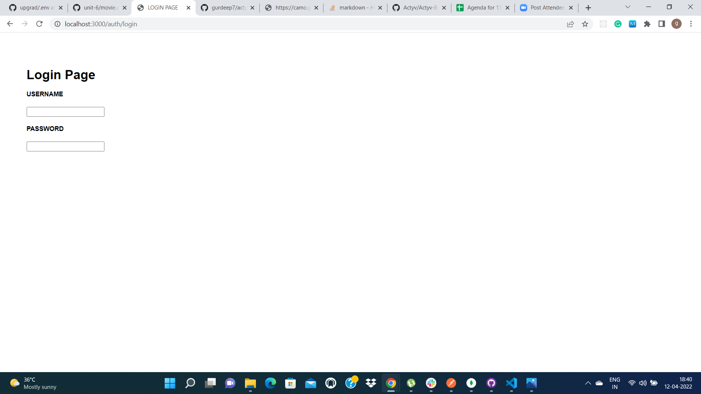

# DAY-1
## path

This module is used for handling and transforming of paths.

## cookie-parser

cookie-parser is a middleware which parses cookies attached to the client request object.

## express.json()
This is a built-in middleware function in Express. It parses incoming requests with JSON payloads and is based on body-parser.

## express.urlencoded({ extended: false })
The express.urlencoded() function is a built-in middleware function in Express. It parses incoming requests with urlencoded payloads and is based on body-parser. The "extended" syntax allows for rich objects and arrays to be encoded into the URL-encoded format, allowing for a JSON-like experience with URL-encoded.

## cookie.parser()

It is used in app.use to register it as middleware, before executing any end route logic or intermediary route logic depending upon order of middleware registration sequence. 

## Path.join()

path.join([path1][, path2][, ...])

Join all the arguments together and normalize the resulting path.

# DAY-2

`http://localhost:3000/books/search`

.png)

`http://localhost:3000/auth/login`

# DAY-3

`http://localhost:3000/book/add`

.png)

### added book successfully

.png)

# DAY-4

`http://localhost:3000/users/register`

.png)

